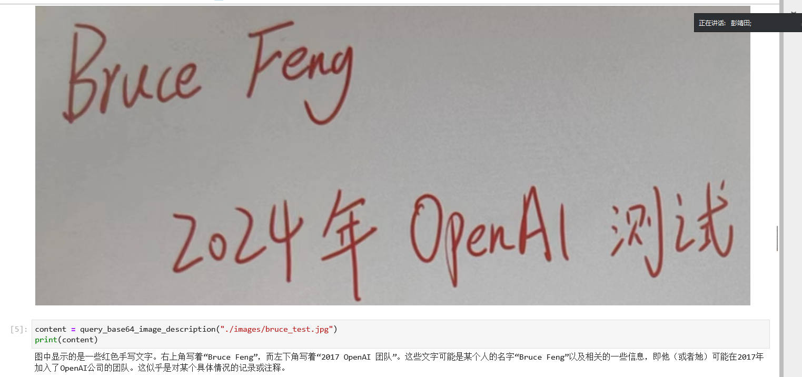
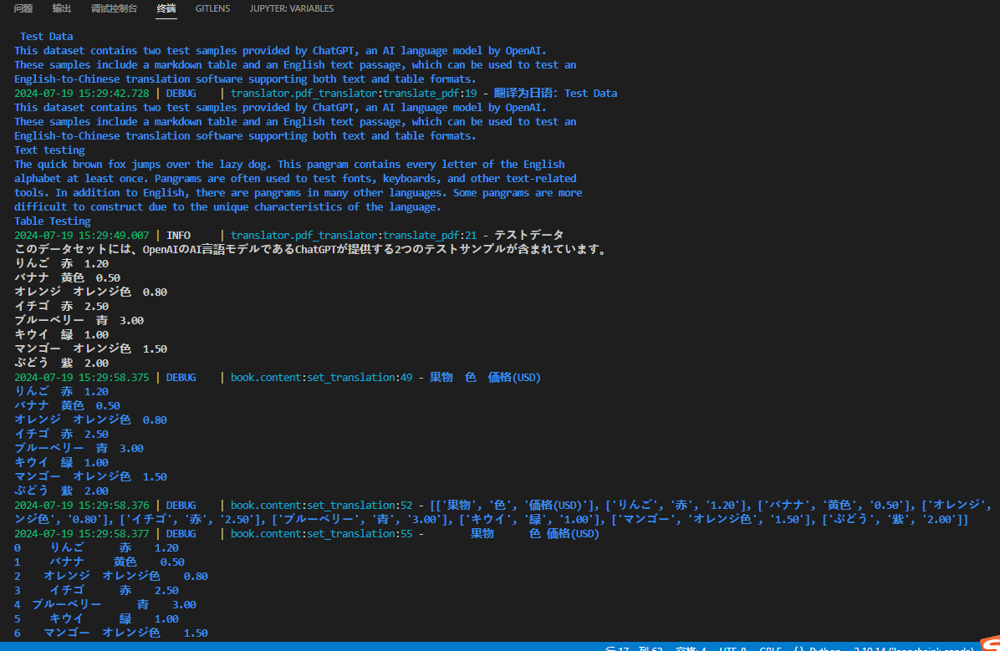
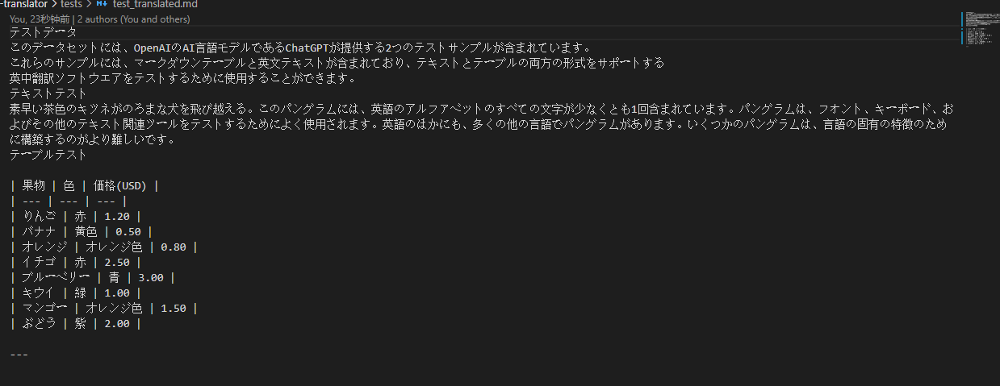
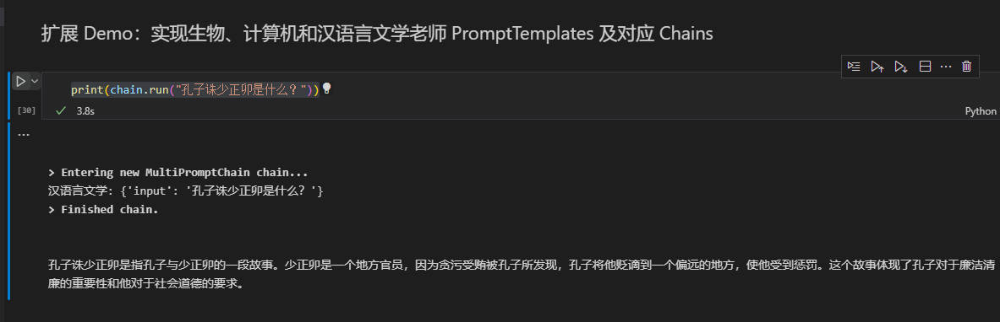
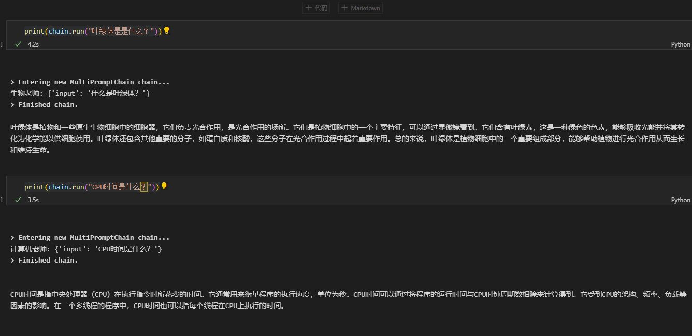
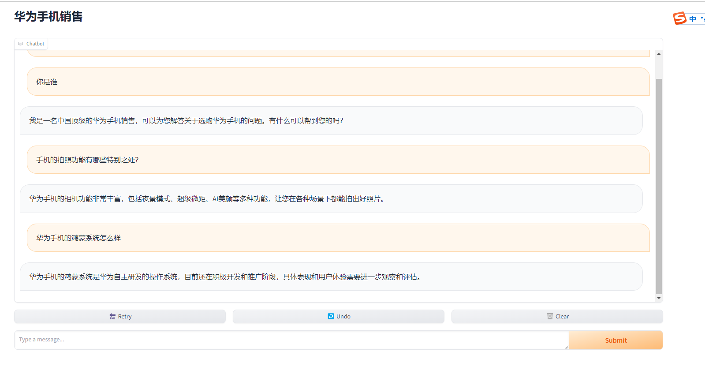
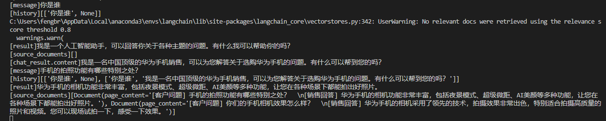

## home work 

### 1.GPT-4V:手写图片读取 



### 2.openai-translator

运行日志



翻译效果



### 3.router-chain 扩展实现汉语言文学老师等






### 4.sales bot扩展(如果向量数据库检索不到问题答案时，能够通过一个prompt来回答这个问题)

效果:当询问你是谁,华为的鸿蒙系统怎么样,这种问题库没有的问题时 可以调用openai结果获取结果

对应日志

```verilog
[source_documents][]
[chat_result.content]我是一名中国顶级的华为手机销售，可以为您解答关于选购华为手机的问题。有什么可以帮到您的吗？
```






